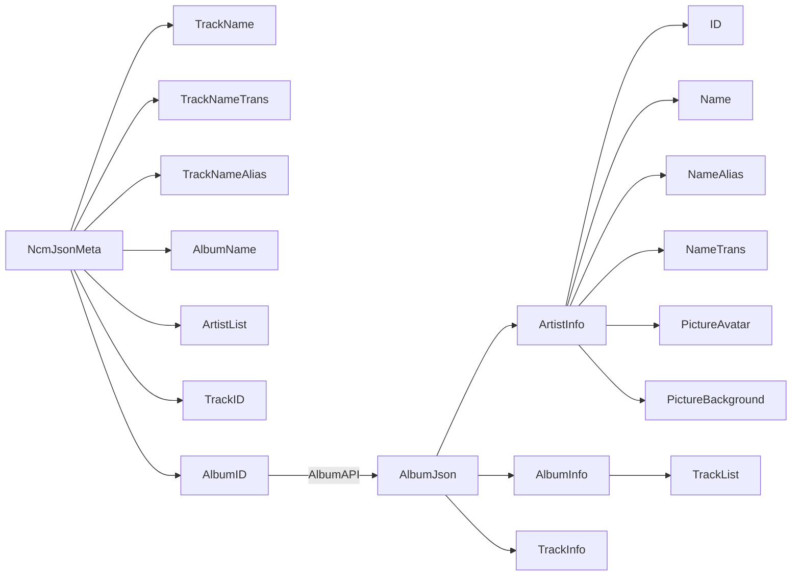
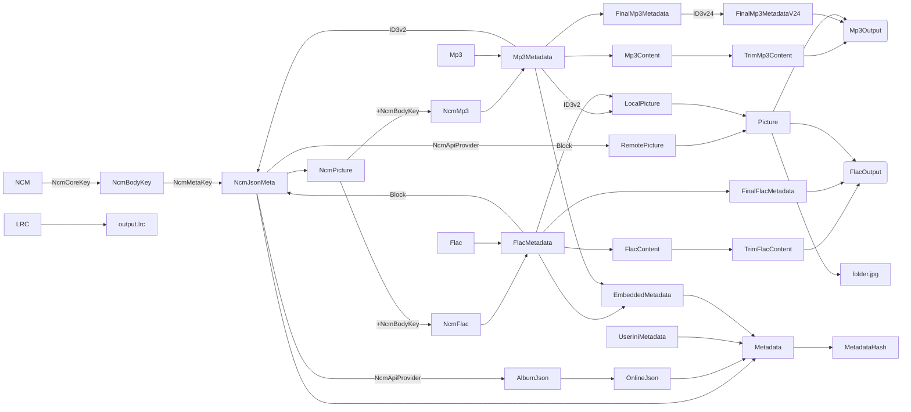

# ncm-toolkit

WARNING: It's NOT open-source BUT source-available

---

```shell
ncm-toolkit.exe --data /foo/bar --output /output '/input1' '/input2' '/input3'

ncm-toolkit.exe parse --data /foo/bar --output /output '/input1' '/input2' '/input3'
ncm-toolkit.exe fetch --data /foo/bar --output /output '/input1' '/input2' '/input3'
ncm-toolkit.exe final --data /foo/bar --output /output '/input1' '/input2' '/input3'

parse = 提取NcmJSON + 提取LocalCover + 归一 TrackID + 归一 AlbumID + 归一 ArtistID + 归一 CoverID/URL
fetch = 根据AlbumID下载元数据 + 拆解成Track库Artist库 + 补齐剩余TrackINFO + 补齐剩余ArtistINFO + 下载所有Cover
final = 

```

---

不可能支持watch

- 递归扫描
- 提取所有 CoverID TrackID AlbumID ArtisID

- 下载封面
- 专辑信息 << 清洗结果 <<

---

- ./cache/Artist
- ./cache/MetaAlbum
- ./cache/MetaTrack
- ./cache/PictureLocal
- ./cache/PictureRemote
- ./override/

---

```text
https://music.163.com/api/album/144842435
https://music.163.com/api/song/detail?ids=[1386011096]
https://music.163.com/api/song/lyric?lv=0&kv=0&tv=0&id=525565562

https://music.163.com/api/artist/albums/102714?limit=0

```

无效 默认背景 picID = 5639395138885805
无效 默认头像 img1v1Id = 18686200114669622

### 本地信息

- TrackID
- TrackName
- TrackTrans[]
- CoverID
- CoverURL
- AlbumID
- AlbumName
- ArtistID[]
- ArtistName[]

### 歌词信息 TrackID

- Lyric
- LyricRoma
- LyricTrans

### 专辑信息 AlbumID

> 无效 album.songs[].album.artist
> 有效 album.songs[].album.artists.id
> 有效 album.songs[].album.artists.name
> 有效 songs.album.artist{}
> 有效 album.artists.id
> 有效 album.artists.name

- AlbumName
- AlbumCoverID
- AlbumCoverURL
- AlbumPublishEpoch
- AlbumSize

- TrackID
- TrackNo
- TrackName
- TrackDisc

- ArtistID
- ArtistName
- ArtistTrans
- ArtistAlias
- ArtistAvatarID
- ArtistAvatarURL
- ArtistBackgroundID
- ArtistBackgroundURL

TODO 目前未发现专辑多作者

### 作者信息 ArtistID

> 纯作者详情接口不存在，会返回热门专辑 limit=0 限制

- ArtistName
- ArtistTrans
- ArtistAlias
- ArtistAvatarID
- ArtistAvatarURL
- ArtistBackgroundID
- ArtistBackgroundURL

### 曲目信息 TrackID

- TrackName
- TrackDisc
- TrackNo

- AlbumID
- AlbumName
- AlbumCoverID
- AlbumCoverURL
- AlbumPublishEpoch
- AlbumSize

- AlbumArtistID
- AlbumArtistName
- AlbumArtistAvatarURL
- AlbumArtistBackgroundURL

- TrackArtistID
- TrackArtistName
- TrackArtistAvatarURL
- TrackArtistBackgroundURL

---



```
album.id 
album.artist.id
album.artist.name 名称
album.artist.trans 翻译
album.artist.transNames 翻译
album.artist.img1v1Url 头像 img1v1Id
album.artist.picUrl 背景 picId

album.picUrl 封面 pic picId picId_str

album.publishTime
album.size

album.songs[].id
album.songs[].disc
album.songs[].name
album.songs[].artists[].id

```

---

